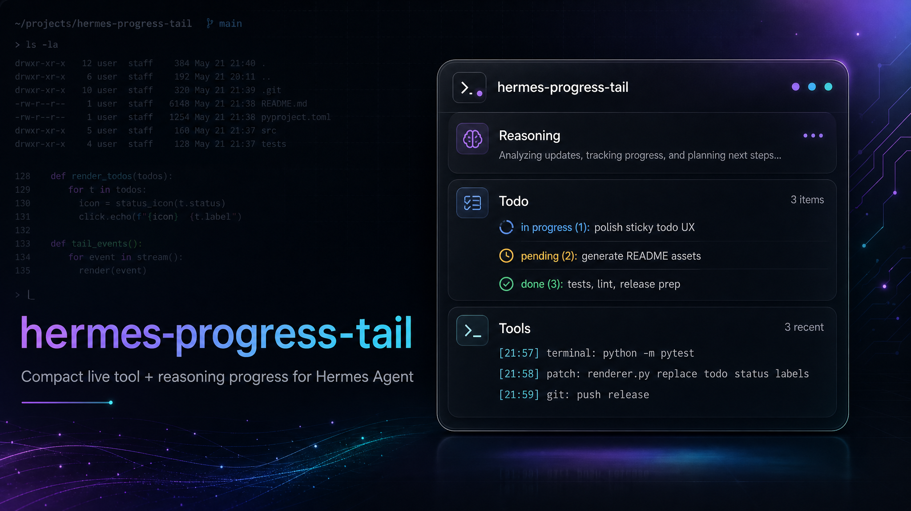
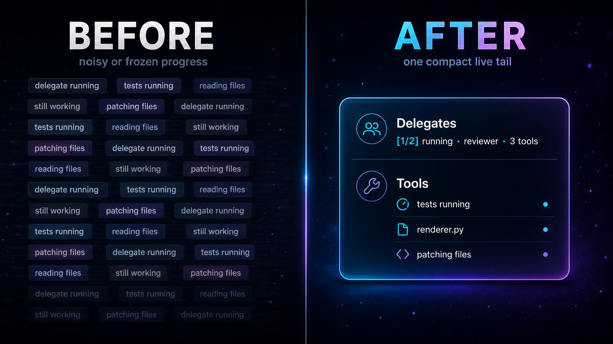

# hermes-progress-tail



Compact Hermes gateway plugin for live progress tails.

## What it does

- Shows latest tool calls, sticky todo state, delegated subagent progress, reasoning/thinking, and background jobs in compact progress bubbles.
- Updates one editable progress message instead of spamming chat.
- Keeps completed turn progress bubbles visible as history.
- Starts a fresh progress bubble for a new user turn after the prior final answer, while true interrupts keep updating the active bubble.
- Keeps running background jobs visible after the parent turn finishes.
- Falls back conservatively on no-edit platforms.
- Redacts common secrets before rendering progress.
- Disables conflicting Hermes built-in progress/reasoning display during recommended install.

## Before / after



## Install

```bash
curl -fsSL https://raw.githubusercontent.com/tickernelz/hermes-progress-tail/v0.1.43/install.sh | bash
```

Restart Hermes manually after install/update:

```text
/restart
```

Uninstall:

```bash
curl -fsSL https://raw.githubusercontent.com/tickernelz/hermes-progress-tail/v0.1.43/uninstall.sh | bash
```

By default, the installer is interactive and asks for target profile plus setup depth. It never restarts Hermes automatically.

## Install options

Use environment variables for automation:

- `HPT_INTERACTIVE=0` — non-interactive install/update.
- `HPT_DRY_RUN=1` — show what would change without writing files; non-interactive by default.
- `HPT_PROFILES=work,personal` — install/update selected profiles.
- `HPT_ALL_PROFILES=1` — install/update default plus every discovered profile.
- `HERMES_HOME=/path/to/.hermes` — target a custom Hermes home.
- `HPT_REPO=owner/repo` — download from another GitHub repo.
- `HPT_REF=v0.1.43` — download a specific tag/branch/ref.
- `HPT_SOURCE_DIR=/path/to/repo` — install from a local checkout instead of downloading.

Examples:

```bash
curl -fsSL https://raw.githubusercontent.com/tickernelz/hermes-progress-tail/v0.1.43/install.sh | env HPT_INTERACTIVE=0 bash
curl -fsSL https://raw.githubusercontent.com/tickernelz/hermes-progress-tail/v0.1.43/install.sh | env HPT_DRY_RUN=1 bash
curl -fsSL https://raw.githubusercontent.com/tickernelz/hermes-progress-tail/v0.1.43/install.sh | env HPT_PROFILES=work,personal bash
curl -fsSL https://raw.githubusercontent.com/tickernelz/hermes-progress-tail/v0.1.43/install.sh | env HPT_ALL_PROFILES=1 bash
```

Local checkout install:

```bash
HPT_INTERACTIVE=0 HPT_SOURCE_DIR=/path/to/hermes-progress-tail bash install.sh
```

Python installer entrypoint:

```bash
python -m hermes_progress_tail.installer install --hermes-home ~/.hermes --set-display-off
```

## Expected config

The installer merges missing defaults without overwriting existing user values.

```yaml
plugins:
  enabled:
    - hermes-progress-tail

display:
  tool_progress: off
  show_reasoning: false

agent:
  gateway_notify_interval: 0

progress_tail:
  enabled: true

  tools:
    enabled: true
    lines: 3
    preview_length: 120
    show_completed: true
    show_duration: true
    timestamp: true
    timestamp_format: "%H:%M"

  delegates:
    enabled: true
    max_delegates: 4
    lines_per_delegate: 2
    max_goal_chars: 48
    max_line_chars: 120
    show_model: false
    show_tool_count: true
    show_completion: true
    thinking: off

  todo:
    sticky: true
    hide_tool_line: true
    max_pending: 3
    max_completed: 3
    max_cancelled: 2
    max_item_chars: 40

  patch:
    detail: smart
    preview_chars: 48
    max_files: 3

  assistant:
    enabled: true
    max_lines: 3
    max_chars: 500
    min_update_chars: 40

  reasoning:
    enabled: true
    max_lines: 3
    max_chars: 600
    min_update_chars: 80
    no_edit_strategy: off

  background_jobs:
    enabled: true
    list_running: true
    show_completed: true
    completed_ttl_seconds: 180
    max_jobs: 4
    head_lines: 2
    tail_lines: 3
    max_line_chars: 120
    update_interval_seconds: 3
    suppress_native_notify: true
    suppress_watch_notifications: true

  renderer:
    strategy: auto
    edit_interval: 1.5
    stale_ttl_seconds: 900
    redact_secrets: true
    mode: focused # focused|sectioned
    style: emoji # emoji|plain
    density: verbose # compact|normal|verbose|debug
    agent_label: "" # optional label for focused HUD header, e.g. Akbar
    code_fence: auto # auto|on|off; auto fences Discord/Slack/Mattermost, not Telegram
    code_fence_language: ""

  no_edit:
    interval_seconds: 30
    min_new_events: 3
    final_summary: true
    max_snapshots_per_turn: 5

  platforms:
    telegram:
      code_fence: off
    discord:
      strategy: live_tail
      tools_enabled: true
      assistant_enabled: true
      reasoning_enabled: true
      delegates_enabled: true
      background_jobs_enabled: true
```

`platforms.<name>` overrides support `enabled`, `strategy`, line/preview/edit timing fields, `show_completed`, feature toggles (`tools_enabled`, `assistant_enabled`, `reasoning_enabled`, `delegates_enabled`, `background_jobs_enabled`), timestamps, and `code_fence`.

Turn lifecycle is internal: completed progress bubbles stay visible, but new user turns get new progress bubbles after the prior final answer. If a background job is still visible, its progress bubble can keep updating.

## Commands

```text
/progresstail status
/progresstail doctor
/progresstail demo
/progresstail demo plain
/progresstail demo failed
```

`/progresstail doctor` also reports config drift. Unknown keys are likely typos or stale docs, for example `warning: unknown config key progress_tail.tools.typo_lines`. Retired keys are old public knobs that should be removed from config, for example `warning: retired config key progress_tail.finalization`.

Progress-tail owns background job visual status by default, so `suppress_native_notify` and `suppress_watch_notifications` default to `true` to avoid duplicate native Hermes process/watch notifications. If those are disabled while `background_jobs.enabled` is still true, `/progresstail doctor` warns because background job output may appear twice.

`redact_secrets` redacts sensitive values, not ordinary file paths. File paths are simplified for readability: project paths become relative, home paths become `~/...`, and WSL Windows user paths like `/mnt/c/Users/name/Downloads/file.pdf` become `~/Downloads/file.pdf`.

## Development

```bash
python -m pip install -e '.[dev]'
pre-commit install
pre-commit run --all-files
python -m pytest
```

Useful direct checks:

```bash
ruff format .
ruff check .
python -m compileall -q .
git diff --check
```

## Notes

Reasoning and delegate progress use guarded plugin-local monkeypatches around Hermes `AIAgent` / `delegate_task` internals. Hermes source files are not modified. If upstream internals change, the plugin should fail closed and `/progresstail status` should show the issue.

Telegram progress bubbles intentionally do not use code fences by default. Hermes Telegram sends may render Markdown on the first message, but live edits are plain text in current Hermes gateway behavior; fenced progress would show literal triple backticks after the first edit. Use `progress_tail.platforms.telegram.code_fence: off` or leave `code_fence: auto`.
